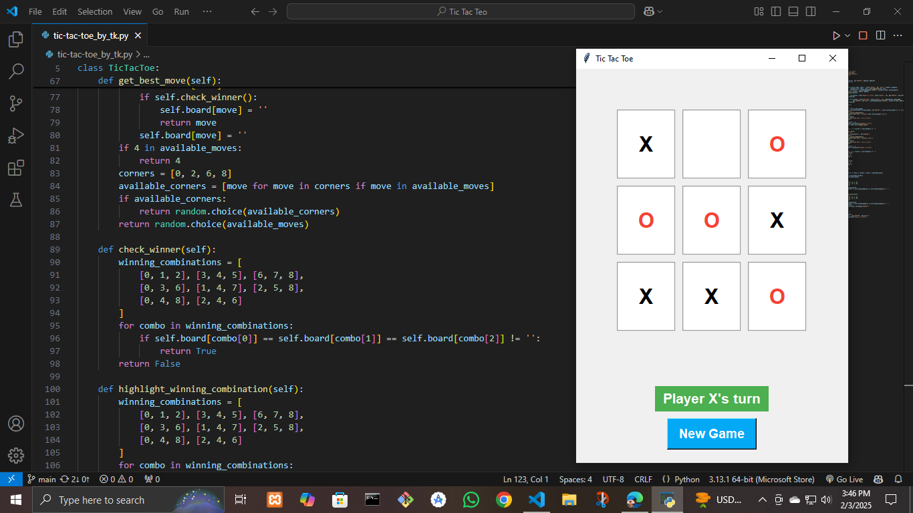

# 🕹️ Tic Tac Toe - Python with Tkinter

A **modern, responsive, and intelligent Tic Tac Toe game** built using **Python and Tkinter**. This project features a **smart AI opponent**, a **material-inspired UI**, and an **interactive gaming experience**.

---

## 📌 Features

- ✅ **Single-Player Mode** – Play against a computer opponent with strategic AI.
- ✅ **Smart AI (Minimax-like Heuristic)** – The AI makes **optimal moves**, blocks the player’s winning chances, and takes advantage when possible.
- ✅ **Material-Inspired UI** – Clean and modern design with smooth colors, rounded buttons, and an intuitive interface.
- ✅ **Winning Combination Highlighting** – When a player wins, the **winning tiles are highlighted** for better visibility.
- ✅ **Game Reset Feature** – Click the **New Game** button to instantly reset the board.
- ✅ **Randomized AI Moves** – If multiple best moves exist, the AI selects one randomly for variety.
- ✅ **Optimized for Performance** – The game logic runs efficiently, ensuring a smooth experience.

---

## 📸 Screenshots




---

## 🚀 Installation & Setup

Follow these steps to set up and run the Tic Tac Toe game on your local machine:

1. **Ensure Python 3.x is installed** on your system.
2. **Clone the repository** using the following command:

   ```bash
   git clone https://github.com/Tarekuzjaman0/Tic-Tac-Teo.git


## 🏆 How to Play
1. **Start the game** – Player (X) makes the first move.
2. **Make a move** – Click on an empty cell to place your X.
3. **AI’s turn** – The computer (O) makes its move.
4. **Winning condition** – The first to align three marks (X or O) in a row, column, or diagonal wins!
5. **Restart anytime** – Click the "New Game" button to play again.

## 🎯 Game Logic
The AI opponent follows an intelligent strategy:
1. **Winning Move** – The AI checks if it can win in the current turn.
2. **Block Player** – If the player is about to win, the AI blocks the winning move.
3. **Center, Corner, or Random** – If no immediate threat or win is found, the AI picks the center, a corner, or a random available spot.

This strategy ensures that the game is always challenging and engaging!

## 🎨 UI Design
The game features a modern, material-inspired UI with:
- Soft, neutral color tones for a smooth aesthetic.
- Rounded buttons for a pleasant user experience.
- High-contrast fonts for better readability.
- Winning combinations highlighted for easy visibility.

## 🤝 Contributing
Want to enhance the game? Feel free to fork the repository, make your changes, and submit a pull request. Contributions are always welcome!

## 📜 License
This project is open-source and available under the [MIT License](LICENSE).

